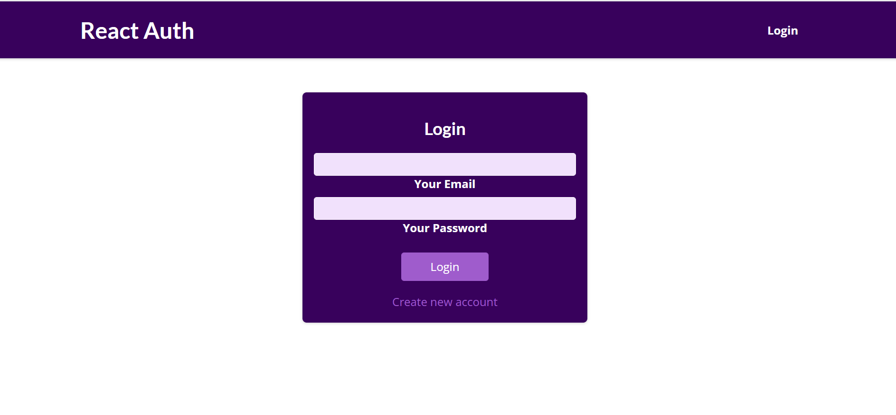

# **AUTHENTICATION** #

The project is based on protecting react  components from unauthorized access.

## Images ##

## Trainer Target
- React Hooks
- React Router

## Trainee Achieved
- having knowledge of React Hooks
- Learned on working in React Router
- knowledge of using API
- knowledge of using axios and making the UI responsive

## Tech stack
### _Language_ : HTML, CSS, Javascript, React